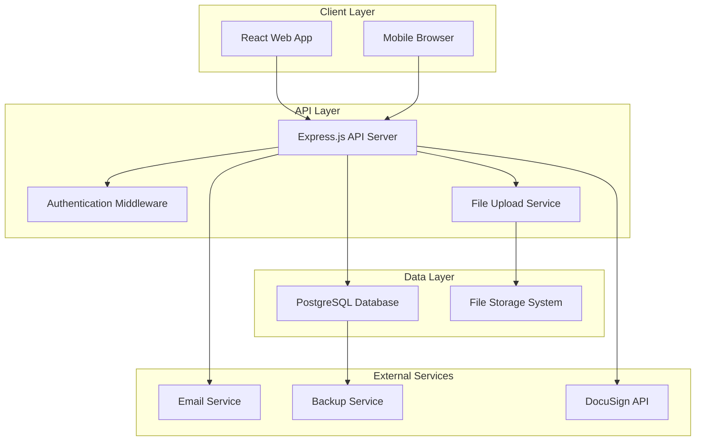
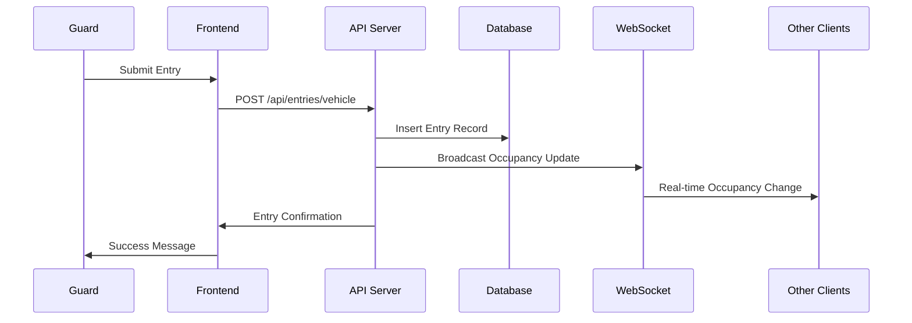
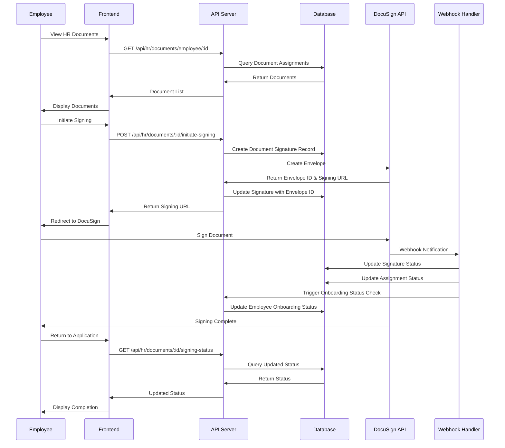

# Security Access Management System - Design Document

## Overview

The Security Access Management System is a web-based application designed to handle real-time entry/exit logging for vehicles, visitors, and trucks across multiple job sites. The system follows a modern three-tier architecture with a React frontend, Node.js/Express backend, and PostgreSQL database. The design emphasizes real-time updates, photo management, role-based access control, and scalability across multiple job sites.

## Architecture

### High-Level Architecture



### Technology Stack

- **Frontend**: React 18 with TypeScript, Material-UI for components, React Query for state management
- **Backend**: Node.js with Express.js, TypeScript, JWT for authentication
- **Database**: PostgreSQL with connection pooling
- **File Storage**: Local file system with organized directory structure (scalable to cloud storage)
- **Real-time Updates**: WebSocket connections for live occupancy updates
- **Authentication**: JWT tokens with refresh token rotation
- **Photo Processing**: Sharp.js for image optimization and thumbnail generation
- **Document Signing**: DocuSign API integration for HR document e-signatures

## Components and Interfaces

### Frontend Components

#### Core Components
- **LoginPage**: Handles user authentication with role-based redirects
- **Dashboard**: Main interface showing occupancy counts and quick actions
- **EntryForm**: Unified form component for vehicle/visitor/truck entries
- **ExitSelection**: Interface for selecting and processing exits
- **SearchInterface**: Advanced search with filters and results display
- **PhotoUpload**: Drag-and-drop photo upload with preview and validation

#### Administrative Components
- **UserManagement**: CRUD operations for user accounts and permissions
- **JobSiteManagement**: Create and configure job sites with capacity limits
- **LogsViewer**: Searchable, filterable log display with export functionality
- **ReportsGenerator**: Analytics dashboard with chart visualizations
- **WatchlistManager**: Blacklist/watchlist management interface
- **EmergencyPanel**: Emergency mode controls and bulk operations

#### HR Document Management Components
- **HRDocumentViewer**: Document viewing interface with PDF/DOCX support
- **DocuSignIntegration**: DocuSign signing interface and status tracking
- **OnboardingDashboard**: Employee onboarding document management and status overview
- **HRDocumentManager**: Administrative interface for uploading and assigning HR documents

### Backend API Endpoints

#### Authentication Endpoints
```
POST /api/auth/login
POST /api/auth/refresh
POST /api/auth/logout
POST /api/auth/reset-password
```

#### Entry/Exit Management
```
POST /api/entries/vehicle
POST /api/entries/visitor  
POST /api/entries/truck
PUT /api/entries/:id/exit
GET /api/entries/active/:jobSiteId
GET /api/entries/search
```

#### Administrative Endpoints
```
GET /api/job-sites
POST /api/job-sites
PUT /api/job-sites/:id
GET /api/occupancy/:jobSiteId
GET /api/logs
POST /api/reports/generate
GET /api/users
POST /api/users
PUT /api/users/:id
```

#### File Management
```
POST /api/photos/upload
GET /api/photos/:id
DELETE /api/photos/:id
```

#### HR Document Management
```
GET /api/hr/documents
GET /api/hr/documents/:id
POST /api/hr/documents
PUT /api/hr/documents/:id
DELETE /api/hr/documents/:id
GET /api/hr/documents/employee/:employeeId
POST /api/hr/documents/:id/assign
POST /api/hr/documents/:id/initiate-signing
GET /api/hr/documents/:id/signing-status
POST /api/hr/docusign/webhook
GET /api/hr/onboarding-status/:employeeId
```

#### DocuSign Integration
```
POST /api/docusign/create-envelope
GET /api/docusign/envelope/:envelopeId/status
POST /api/docusign/webhook
GET /api/docusign/signing-url/:envelopeId
```

### Database Schema

#### Core Tables

**users**
- id (UUID, Primary Key)
- username (VARCHAR, Unique)
- password_hash (VARCHAR)
- role (ENUM: 'guard', 'admin', 'employee')
- job_site_access (JSON array of job site IDs)
- employee_id (VARCHAR, Nullable) // For employees linked to HR system
- onboarding_status (ENUM: 'pending', 'in_progress', 'completed', Nullable)
- created_at (TIMESTAMP)
- is_active (BOOLEAN)

**job_sites**
- id (UUID, Primary Key)
- name (VARCHAR)
- address (TEXT)
- contact_info (JSON)
- vehicle_capacity (INTEGER)
- visitor_capacity (INTEGER)
- truck_capacity (INTEGER)
- is_active (BOOLEAN)
- created_at (TIMESTAMP)

**entries**
- id (UUID, Primary Key)
- job_site_id (UUID, Foreign Key)
- entry_type (ENUM: 'vehicle', 'visitor', 'truck')
- entry_data (JSONB) // Flexible storage for type-specific data
- entry_time (TIMESTAMP)
- exit_time (TIMESTAMP, Nullable)
- guard_id (UUID, Foreign Key)
- photos (JSON array of photo IDs)
- status (ENUM: 'active', 'exited', 'emergency_exit')
- created_at (TIMESTAMP)

**photos**
- id (UUID, Primary Key)
- entry_id (UUID, Foreign Key)
- filename (VARCHAR)
- file_path (VARCHAR)
- file_size (INTEGER)
- mime_type (VARCHAR)
- thumbnail_path (VARCHAR)
- uploaded_at (TIMESTAMP)

**watchlist**
- id (UUID, Primary Key)
- type (ENUM: 'person', 'vehicle')
- identifier (VARCHAR) // Name or license plate
- reason (TEXT)
- alert_level (ENUM: 'low', 'medium', 'high')
- created_by (UUID, Foreign Key)
- created_at (TIMESTAMP)
- is_active (BOOLEAN)

**audit_logs**
- id (UUID, Primary Key)
- user_id (UUID, Foreign Key)
- action (VARCHAR)
- resource_type (VARCHAR)
- resource_id (UUID)
- details (JSONB)
- timestamp (TIMESTAMP)

**hr_documents**
- id (UUID, Primary Key)
- title (VARCHAR)
- description (TEXT)
- document_type (ENUM: 'onboarding', 'policy', 'contract', 'other')
- file_path (VARCHAR)
- file_name (VARCHAR)
- file_size (INTEGER)
- mime_type (VARCHAR)
- is_required (BOOLEAN)
- created_by (UUID, Foreign Key)
- created_at (TIMESTAMP)
- updated_at (TIMESTAMP)
- is_active (BOOLEAN)

**document_assignments**
- id (UUID, Primary Key)
- document_id (UUID, Foreign Key)
- employee_id (UUID, Foreign Key)
- assigned_by (UUID, Foreign Key)
- assigned_at (TIMESTAMP)
- due_date (TIMESTAMP, Nullable)
- status (ENUM: 'pending', 'in_progress', 'completed', 'declined', 'expired')
- completed_at (TIMESTAMP, Nullable)

**document_signatures**
- id (UUID, Primary Key)
- assignment_id (UUID, Foreign Key)
- docusign_envelope_id (VARCHAR, Unique)
- docusign_envelope_status (VARCHAR)
- signing_url (TEXT, Nullable)
- signed_at (TIMESTAMP, Nullable)
- declined_at (TIMESTAMP, Nullable)
- declined_reason (TEXT, Nullable)
- signer_email (VARCHAR)
- signer_name (VARCHAR)
- ip_address (VARCHAR, Nullable)
- user_agent (TEXT, Nullable)
- created_at (TIMESTAMP)
- updated_at (TIMESTAMP)

**docusign_webhook_events**
- id (UUID, Primary Key)
- envelope_id (VARCHAR)
- event_type (VARCHAR)
- event_data (JSONB)
- processed (BOOLEAN)
- processed_at (TIMESTAMP, Nullable)
- created_at (TIMESTAMP)

## Data Models

### Entry Data Structure

The `entry_data` JSONB field stores type-specific information:

**Vehicle Entry:**
```json
{
  "license_plate": "ABC123",
  "vehicle_type": "car",
  "driver_name": "John Doe",
  "company": "ABC Corp",
  "purpose": "Meeting",
  "expected_duration": 120
}
```

**Visitor Entry:**
```json
{
  "name": "Jane Smith",
  "company": "XYZ Inc",
  "contact_phone": "555-0123",
  "purpose": "Site inspection",
  "host_contact": "Bob Johnson",
  "expected_duration": 180
}
```

**Truck Entry:**
```json
{
  "license_plate": "TRK456",
  "company": "Delivery Co",
  "driver_name": "Mike Wilson",
  "cargo_description": "Construction materials",
  "delivery_pickup": "delivery",
  "expected_duration": 60
}
```

### HR Document Data Structure

**Document Assignment:**
```json
{
  "document_id": "uuid",
  "employee_id": "uuid",
  "assigned_by": "uuid",
  "due_date": "2024-12-31T23:59:59Z",
  "status": "pending"
}
```

**DocuSign Envelope Creation:**
```json
{
  "document_id": "uuid",
  "assignment_id": "uuid",
  "signer_email": "employee@example.com",
  "signer_name": "John Doe",
  "return_url": "https://app.example.com/hr/documents/callback"
}
```

**DocuSign Webhook Event:**
```json
{
  "event": "envelope-sent",
  "envelope_id": "docusign-envelope-id",
  "status": "sent",
  "timestamp": "2024-01-15T10:30:00Z",
  "data": {
    "signer_email": "employee@example.com",
    "signer_name": "John Doe"
  }
}
```

### Real-time Data Flow



### DocuSign Integration Workflow



## Error Handling

### Frontend Error Handling
- **Network Errors**: Retry mechanism with exponential backoff
- **Validation Errors**: Real-time form validation with clear error messages
- **Authentication Errors**: Automatic token refresh and re-authentication flow
- **File Upload Errors**: Progress indicators and detailed error messages

### Backend Error Handling
- **Database Errors**: Connection pooling with automatic retry and failover
- **File System Errors**: Graceful degradation when photo uploads fail
- **Authentication Errors**: Secure error messages that don't leak information
- **Rate Limiting**: Prevent abuse with configurable rate limits per endpoint

### Error Response Format
```json
{
  "success": false,
  "error": {
    "code": "VALIDATION_ERROR",
    "message": "Invalid license plate format",
    "details": {
      "field": "license_plate",
      "expected_format": "ABC123"
    }
  }
}
```

## Testing Strategy

### Unit Testing
- **Frontend**: Jest and React Testing Library for component testing
- **Backend**: Jest for API endpoint testing with mock database
- **Database**: Separate test database with automated migrations
- **Photo Upload**: Mock file system for testing upload functionality
- **HR Documents**: Mock document storage for testing document management
- **DocuSign Integration**: Mock DocuSign API client for testing signing workflows

### Integration Testing
- **API Integration**: Supertest for full request/response cycle testing
- **Database Integration**: Test database operations with real PostgreSQL instance
- **Authentication Flow**: End-to-end authentication testing
- **File Upload Integration**: Test complete photo upload and retrieval process
- **DocuSign Integration**: Test DocuSign API integration with sandbox environment
- **Webhook Processing**: Test DocuSign webhook event handling and status updates

### End-to-End Testing
- **User Workflows**: Cypress tests for complete entry/exit workflows
- **Admin Functions**: Test job site creation, user management, and reporting
- **Emergency Scenarios**: Test emergency mode activation and bulk operations
- **Cross-browser Testing**: Ensure compatibility across modern browsers
- **HR Document Workflows**: Test complete document viewing, signing, and status tracking
- **DocuSign Signing Flow**: Test end-to-end document signing workflow with DocuSign sandbox

### Performance Testing
- **Load Testing**: Simulate multiple concurrent users and entries
- **Database Performance**: Test query performance with large datasets
- **Photo Upload Performance**: Test multiple simultaneous photo uploads
- **Real-time Updates**: Test WebSocket performance under load

### Security Testing
- **Authentication Testing**: Test JWT token security and refresh mechanisms
- **Authorization Testing**: Verify role-based access controls
- **Input Validation**: Test for SQL injection and XSS vulnerabilities
- **File Upload Security**: Test for malicious file upload attempts
- **HR Document Access Control**: Test employee access restrictions to assigned documents only
- **DocuSign Webhook Security**: Test webhook signature verification and authentication
- **Document Storage Security**: Test secure document storage and access controls

## Security Considerations

### Authentication & Authorization
- JWT tokens with short expiration times (15 minutes) and refresh tokens
- Role-based access control with job site restrictions
- Password hashing using bcrypt with salt rounds
- Account lockout after failed login attempts

### Data Protection
- Input validation and sanitization on all endpoints
- SQL injection prevention using parameterized queries
- XSS protection with Content Security Policy headers
- File upload validation for type, size, and content

### Photo Security
- Secure file storage with access controls
- Photo metadata stripping to remove sensitive information
- Thumbnail generation for performance without exposing full images
- Regular cleanup of orphaned photo files

### HR Document & DocuSign Security
- Secure storage of HR documents with role-based access control
- Employee access restricted to their assigned documents only
- DocuSign API credentials stored securely using environment variables
- Webhook signature verification for DocuSign webhook events
- Document access logging and audit trails for compliance
- Encrypted document storage for sensitive HR materials
- DocuSign envelope expiration and automatic status updates
- Secure signing URL generation with time-limited access
- IP address and user agent logging for signing events
- Document version control and change tracking

## Scalability Considerations

### Database Optimization
- Indexing on frequently queried fields (job_site_id, entry_time, status)
- Partitioning of entries table by date for large datasets
- Connection pooling to handle concurrent requests
- Read replicas for reporting queries

### File Storage Scalability
- Organized directory structure by date and job site
- Configurable storage backends (local, AWS S3, etc.)
- Image optimization and compression
- CDN integration for photo delivery

### Application Scalability
- Stateless API design for horizontal scaling
- Caching layer for frequently accessed data
- WebSocket connection management for real-time updates
- Background job processing for reports and analytics

### HR Document & DocuSign Scalability
- Document storage optimization with cloud storage integration (S3, Azure Blob)
- DocuSign API rate limiting and request queuing
- Asynchronous webhook processing for DocuSign events
- Document caching for frequently accessed HR documents
- Batch document assignment processing for large employee groups
- Indexing on document assignments by employee_id and status for fast queries